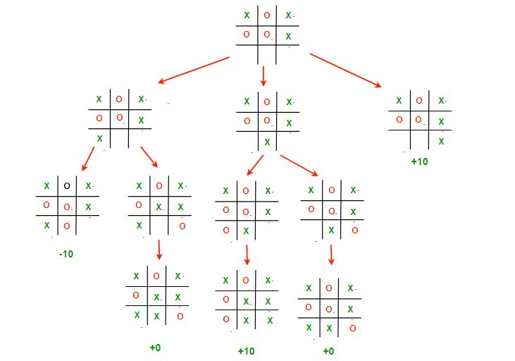

# Tic Tac Toe Game

## Table of Contents
- [Description](#description)
- [Features](#features)
- [Getting Started](#getting-started)
  - [Prerequisites](#prerequisites)
  - [Installation](#installation)
- [Usage](#usage)
- [Opponent Algorithm](#opponent-algorithm)

## Description
This is a simple implementation of the classic Tic Tac Toe game in Python.
It allows you to play against an AI opponent.

## Features
Single-player mode against an AI opponent using the 
[minimax](https://www.geeksforgeeks.org/finding-optimal-move-in-tic-tac-toe-using-minimax-algorithm-in-game-theory/) 
algorithm. Text-based user interface for easy interaction.

## Getting Started
Follow the instructions below to get started with the Tic Tac Toe game.

### Prerequisites
- Python 3.x installed on your computer.

### Installation
1. Clone the repository to your local machine:
   ```bash
   git clone https://github.com/londony11/Tic_Tac_Toe.git
   ```
2. Navigate to the project directory:
   ```bash
   cd tic-tac-toe
   ```
3. Run the game:
   ```bash
   python main.py
   ```

## Usage
- Launch the game, and you play against the AI opponent ("O").
- Follow the on-screen instructions to make your moves by specifying row and column numbers. (0-2)

## Opponent Algorithm
The opponent uses the minimax algorithm to make strategic moves.
It explores all possible moves to find the best one, maximizing its chances of winning.


source: https://media.geeksforgeeks.org/wp-content/uploads/TIC_TAC.jpg
